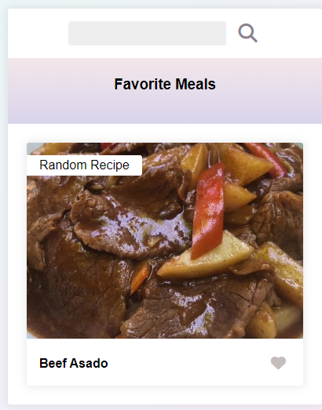

#Recipe App

Introduction of the project aim:
This is an app that fetches from a public api a displays recipes

Technologies used:
HTML, CSS and vanilla Javascript
No NPM needed

Launch:
after cloning the repository you should be able to run Live server extension and be able to see the recipes.

Use examples:

if you click on the recipe you should get a pop up that will give you the instructions and ingredients of the recipe, if you click on the heart the recipe will get favorite and will show in the favorite menu bar. there is a randomized recipe that will change every time the app reloads
when searching in the search bar then clicking on the search icon it should show you all recipes with similar name.

credits:
this app was one of the first app i made with a back end while learning therefore it was a code along with the youtuber Florin Pop

updated on:28/02/2024
